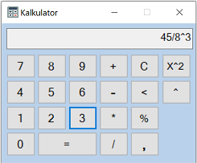

# Kalkulator
> Projekt kalkulatora napisanego w języku C#, który był pierwszym projektem stworzonym na studiach informatycznych. Oprócz podstawowych operacji matematycznych (dodawanie, odejmowanie, mnożenie, dzielenie) kalkulator posiada funkcje obliczania procentów i potęgowania.

## Spis treści
* [Informacje ogólne](#informacje-ogólne)
* [Użyte technologie](#użyte-technologie)
* [Uruchomienie](#uruchomienie)
* [Status projektu](#status-projektu)
* [Udoskonalenie projektu](#udoskonalenie-projektu)

## Informacje ogólne
- Celem projektu było stworzenie prostego kalkulatora w postaci aplikacji Windows (Windows Forms Application) oraz nauka języka C#.
- Był to projekt zaliczeniowy z programowania obiektowego.

## Użyte technologie
- C# - wersja 7.3
- .NET Freamework - wersja 4.7.2

## Zrzuty ekranu

## Uruchomienie
W celu uruchomienia aplikacji wystarczy pobrać paczkę i wejść w folder *bin*, a następnie wybrać plik *Kalkulator_V2.exe*.

## Status projektu
Projekt narazie zawieszony, ale w przyszłości będzie poprawiany.

## Udoskonalenie projektu

Do poprawy:
- Zmiana sposobu przyjmowania i wykonywania działań

Do zrobienia:
- Dodanie nowych funkcji matematycznych np. pierwiastkowanie, obliczanie kątów itp.

